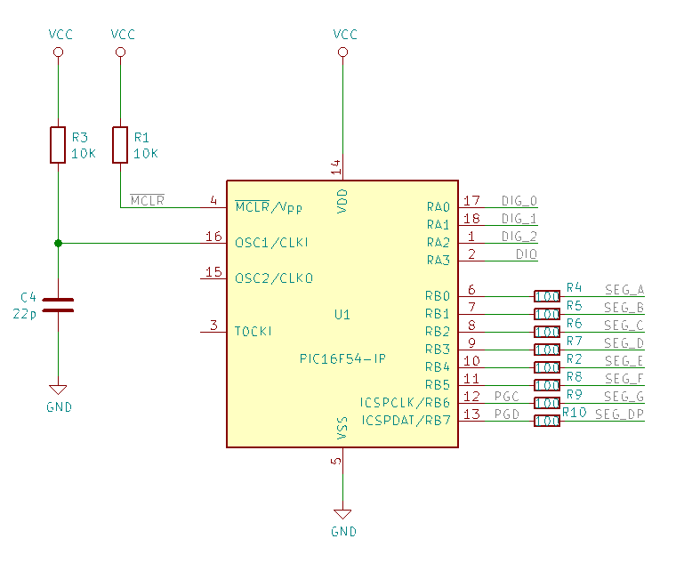
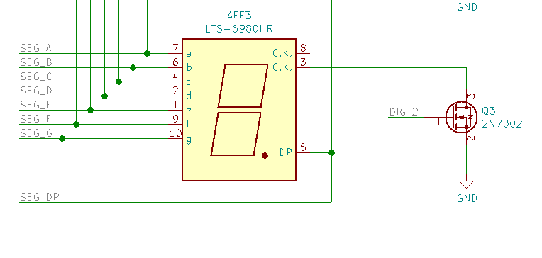
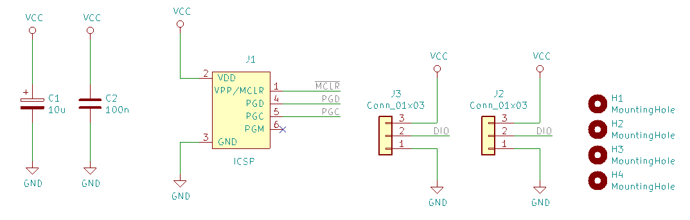
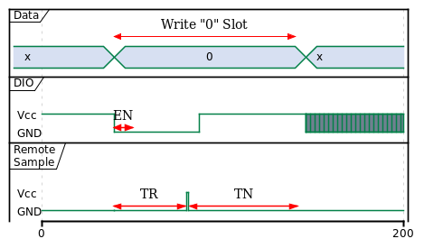
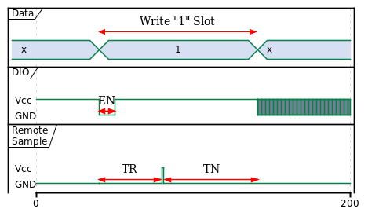
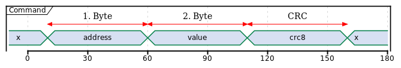
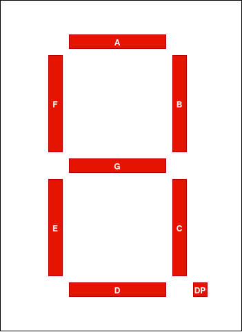

 
# Overview

The Driver control the display over One Wire bus. The driver can set up the luminosity and shut-down the display. When the driver shutdown the display, the display can only be startup again from power on or pushing the disable/enable-pin down. 

The "PIC16F54 7 segments display":

- 3 x 7 segments common cathode (5611AS)
- 1 x PIC16F54 Micro-Controller
- 3 x 2N7002 Transistors

# Features

- One wire bus
- Disable/Enable Pin
- Dimming
- Sleep (Energy saving, Then you need two pins) 
- 3 characters

# Schematic

The schematic[^schematic] and the gerber[^gerber] files

[^gerber]: documents/gerber.zip
[^schematic]: documents/images/pic16f54-7-segments-display-schematic.pdf

{ width=60% }

{ width=80% }

{ width=100% }

# One Wire Protocol

## Bit Timing

{ width=60% }

{ width=60% }

Table: Bit Timing

| Symbol | Description | Min | Typ | Max | Unit |
|:---:|:---|:---|:---:|---:|---:|
| EN | Enable | 144 | 450 | 360 | us |
| TR | Time to read | 380 | 500 | 720 | us |
| TN | Time to new bit | 144| 1500 | 7500 | us |  

EN
: Start of new bit

TR
: Time between start of EN and the remote sample the DIO

TN
: Time the remote spend wait for new Data, this should be bigger than the minimum allowed time for EN

## Command Operation

address
: 1.Byte of the command, determines which register to be updated.

value
: 2.Byte of the command, the value to be updated.

CRC
: The CRC, actually the crc8 with polynomial 0x1D of the 1. and 2. byte.

x
: Timeslot leave to calculate the crc8 of the actual byte.

Table: Byte Timing

| Symbol | Description | Min | Typ | Max | Unit |
|:---:|:---|:---|:---:|---:|---:|
| TB | Time to calcul the crc8 of the actual byte | 144 | 450 | 7500 | us |

## Registers

Table: Driver Registers

| Adresse | Description | Default |
|:--------|:-----------:|--------:|
| 0x00 | Option | 0x00 |
| 0x01 | Digit 1 | 0x00 |
| 0x02 | Digit 2 | 0x00 |
| 0x03 | Digit 3 | 0x00 |

### Option Register Bit Assignement

This register acts as setting register.

Table: Option Register 

| Option | 7 | 6 | 5 | 4 | 3 | 2 | 1 | 0 |
|:---|:-----:|:-----:|:-----:|:-----:|:-----:|:-----:|:-----:|:-----:|
| | SLEEP | <t style="text-decoration:overline">EN</t> | DIM5  | DIM4  | DIM3  | DIM2  | DIM1  | DIM0  |
| Default | 0 | 0 | 0 | 0 | 0 | 0 | 0 | 0 |

DIM<5-0>
: Dimmer, '0b000000' is full power and '0b111111' is dark.

<t style="text-decoration:overline">EN</t>
: Writing '1' to this position will power off the segments. All segments are off, but the controller is still running.
 
SLEEP
: The controller go in sleep. Can only be restart push the <t style="text-decoration:overline">MCLR</t> pin down. All registers will be reset to theirs default value. 

<!--  -->

### Digit x Register Bit Assignement

Registers describing the segments that should light on. Writing '1' to a position will light on this segments. 

Table: Digit Register Bit Assignement

| Bit 7 | Bit 6 | Bit 5 | Bit 4 | Bit 3 | Bit 2 | Bit 1 | Bit 0 |
|:-----:|:-----:|:-----:|:-----:|:-----:|:-----:|:-----:|:-----:|
| DP    | G     | F  | E | D | C | B | A |

{ width=30% }

---
title: "One Wire Driver for the PIC16F54 7 segments display"
author: Olivier Pimi
date: \today
geometry: "left=3cm,right=3cm,top=2cm,bottom=2cm"
output: pdf_document
caption-justification : centering
---

